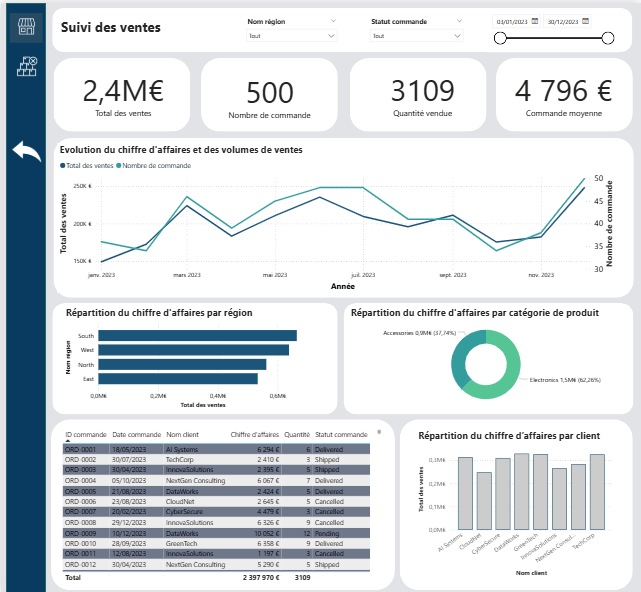

# 📊 Tableau de bord Power BI - Suivi des ventes

## 📌 Description

Ce projet présente un tableau de bord interactif réalisé avec **Power BI** afin de suivre et analyser les performances commerciales.
Les données concernent les **ventes de produits électroniques et d’accessoires**.

Le fichier de données utilisé est :

* **`sales.csv`** : données de ventes (commandes, chiffre d’affaires, quantité, statut, etc.)

---

## 🔄 Préparation des données (Power Query)

Avant de construire le tableau de bord, les données brutes du fichier **`sales_2.csv`** ont été transformées dans **Power Query** à travers plusieurs étapes :

* **Importation et nettoyage** des données brutes
* **Transformation des types de données** (dates, valeurs numériques, etc.)
* **Filtrage et harmonisation des colonnes** (statuts, clients, régions)

Ces transformations garantissent la **qualité et la cohérence des données** avant leur exploitation dans Power BI.

---

## 🧮 Mesures DAX créées

Afin d’obtenir des indicateurs dynamiques et exploitables, plusieurs mesures ont été créées avec le langage **DAX** :

* 💰 **Total des ventes**
* 📦 **Nombre de commandes**
* 🔢 **Quantité vendue**
* 📊 **Commande moyenne**
* ❌ **Commandes annulées**
* 📉**Total des commandes annulées**
* 📊 **Pourcentage de commandes annulées**
* 💵 **Montants** (agrégations financières spécifiques)

Ces mesures permettent de calculer les **KPI clés** affichés dans le tableau de bord et de faciliter les analyses par client, produit, région et période.

---

## 📊 Indicateurs principaux

Le tableau de bord met en avant des indicateurs clés :

* 💰 **Total des ventes** : 2,4M€
* 📦 **Nombre de commandes** : 500
* 🔢 **Quantité vendue** : 3109
* 📊 **Commande moyenne** : 4 796 €

---

## 📸 Aperçu du tableau de bord

---

## 📈 Fonctionnalités

* **Évolution des ventes** au fil des mois (CA et volume de commandes)
* **Répartition du chiffre d’affaires par région** (South, West, North, East)
* **Répartition par catégorie de produit** :

  * Electronics (62,26%)
  * Accessories (37,74%)
* **Analyse par client** pour identifier les principaux contributeurs
* **Tableau détaillé des commandes** avec statut, client, quantité et chiffre d’affaires
* **Filtres dynamiques** sur la période, le statut de commande et la région

---

## 🔮 Améliorations possibles

* Ajouter une analyse de la **marge bénéficiaire**
* Intégrer une **prévision des ventes**
* Connecter le tableau de bord à une **base de données en temps réel**

---

 Ce projet illustre comment transformer des données brutes en **insights actionnables** grâce à Power BI, dans le cadre des ventes de produits **électroniques et accessoires**.

